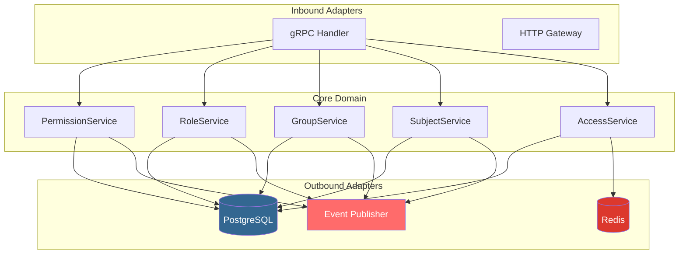
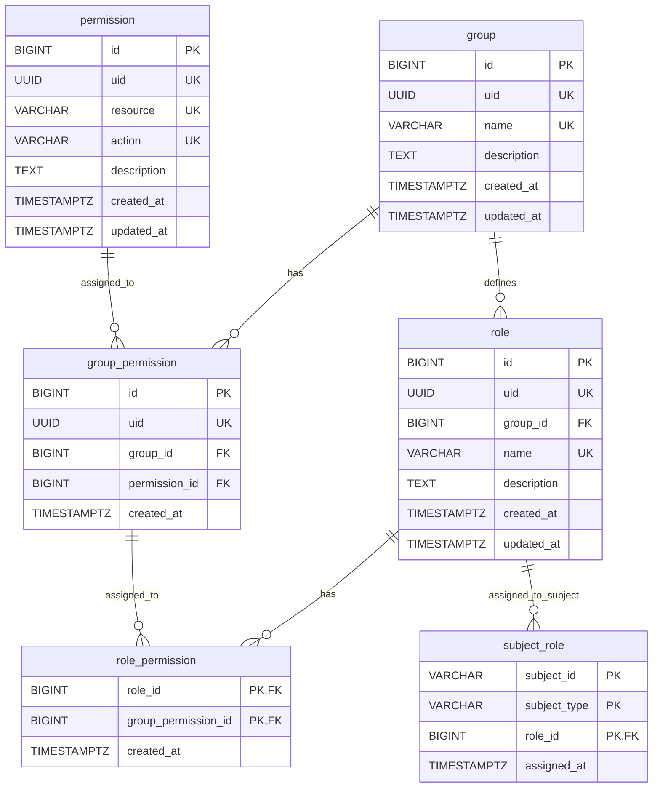

# Service Access

Core authorization service responsible for access control decisions across applications and services. Manages permissions, roles, groups, and subjects with a flexible RBAC (Role-Based Access Control) architecture.

## Tech Stack

- **Language:** Go 1.25+
- **Database:** PostgreSQL 18
- **Cache:** Redis
- **API:** gRPC + gRPC-Gateway
- **Migrations:** Liquibase
- **Observability:** OpenTelemetry (OTLP)
- **Messaging:** RabbitMQ (optional)

## Table of Contents

- [Overview](#overview)
- [Features](#features)
- [Architecture](#architecture)
- [Quick Start](#quick-start)
- [Data Model](#data-model)
- [Development](#development)
- [Configuration](#configuration)
- [API Reference](#api-reference)
- [Testing](#testing)
- [Related Projects](#related-projects)

## Overview

Service Access is a microservice that provides centralized authorization decisions for the MTAmedia backend ecosystem. It implements a flexible RBAC model with the following key concepts:

- **Permission:** A specific action that can be performed on a resource (e.g., `user:read`, `post:delete`)
- **Group:** A collection of permissions that can be assigned to roles
- **Role:** A named set of permissions within a group context
- **Subject:** An external entity (user, service account) that can be assigned roles
- **Access:** The result of evaluating whether a subject has permission to perform an action on a resource

The service follows **hexagonal architecture** (ports and adapters) to maintain clean separation between business logic and infrastructure concerns.

## Features

### Core Capabilities
- **Permission Management:** Create, read, update, and delete permissions
- **Role-Based Access Control (RBAC):** Define roles and assign permissions
- **Group Organization:** Organize permissions into groups for better management
- **Subject Management:** Manage users and service accounts
- **Access Evaluation:** Real-time authorization decisions based on subject, resource, and action
- **Flexible Assignment:** Assign roles to subjects with fine-grained control

### Infrastructure Features
- **Event-Driven:** Publish domain events for audit logging and integration
- **Observable:** Built-in OpenTelemetry support for metrics, traces, and logs
- **High Performance:** Redis caching for frequently accessed data
- **Transactional:** Unit of Work pattern ensures data consistency across operations

### Developer Experience
- **Comprehensive Testing:** Unit, integration, and E2E tests
- **Mock Generation:** Automated mock generation using mockery
- **Type Safety:** Strong typing with Go and Protocol Buffers
- **Clean Code:** Table-driven tests, clear naming, SOLID principles

## Architecture

### High-Level Overview



### Hexagonal Architecture

The service follows strict hexagonal architecture principles:

- **Core Domain:** Business logic and entities with no external dependencies
- **Ports:** Interfaces defined by the core for external interactions
- **Adapters:** Implementations that integrate with external systems

```
internal/
├── core/
│   ├── domain/          # Entities, value objects, domain events
│   ├── port/            # Interface definitions
│   └── service/         # Domain service implementations
└── adapter/
    ├── handler/         # gRPC/HTTP handlers (inbound)
    ├── repository/      # PostgreSQL repositories (outbound)
    ├── event/           # Event publishers (outbound)
    └── resolver/        # Relationship resolution logic
```

### Design Patterns

- **Port and Adapter:** Clean separation of concerns
- **Unit of Work:** Transaction management across repositories
- **Observer:** Domain event listeners
- **Repository:** Data access abstraction
- **Resolver:** Complex relationship resolution

## Quick Start

### Prerequisites

- Go 1.25 or higher
- Docker and Docker Compose
- PostgreSQL 18
- Redis
- (Optional) RabbitMQ

### Local Development Setup

1. **Clone the repository:**
```bash
git clone <repository-url>
cd service-access
```

2. **Start infrastructure:**
```bash
docker-compose up -d
```

This starts PostgreSQL, Redis, and RabbitMQ containers.

3. **Configure the service:**
```bash
cp config.yaml.example config.yaml
# Edit config.yaml with your database credentials
```

4. **Run database migrations:**
```bash
cd ../service-access-db
make update
cd ../service-access
```

5. **Generate protobuf code:**
```bash
cd ../service-access-proto
make go
cd ../service-access
```

6. **Run the service:**
```bash
make run
```

The gRPC server will start on port 50051.

### Using Makefile Commands

```bash
make build              # Build Linux binary
make test               # Run all tests
make test-cover         # Run tests with coverage
make mocks              # Generate mocks
make lint               # Run linter
make fmt                # Format code
```

## Data Model

### Entity Relationship Diagram



### Entity Descriptions

| Entity | Description |
|--------|-------------|
| **Permission** | Represents a specific action on a resource (e.g., `user:read`) |
| **Group** | Organizes permissions for a specific domain or context |
| **Group Permission** | Associates a permission with a group |
| **Role** | Named set of permissions within a group |
| **Role Permission** | Associates a role with group permissions |
| **Subject Role** | Assigns a role to a subject (user, service account) |

### Access Evaluation Flow

When checking access:
1. Subject's roles are retrieved
2. For each role, get the associated group permissions
3. Each group permission maps to a specific permission (resource + action)
4. If any matching permission is found, access is granted

## Development

### Project Structure

```
service-access/
├── cmd/                    # Application entry points
│   ├── main.go            # gRPC server
│   └── version.go         # Version information
├── internal/
│   ├── adapter/           # Adapters layer
│   │   ├── api/grpc/     # gRPC handlers
│   │   ├── event/        # Event publishers
│   │   ├── repository/   # Repository implementations
│   │   └── resolver/     # Relationship resolvers
│   ├── config/           # Configuration management
│   ├── core/             # Domain layer
│   │   ├── domain/       # Entities and events
│   │   ├── port/         # Interface definitions
│   │   └── service/      # Domain services
│   └── infra/           # Infrastructure
├── pkg/                  # Public packages
├── mocks/               # Generated mocks
└── test/               # Test suites
    ├── e2e/            # End-to-end tests
    ├── integration/    # Integration tests
    └── util/          # Test utilities
```

### Key Services

| Service | Responsibility |
|---------|----------------|
| **PermissionService** | CRUD operations for permissions |
| **RoleService** | Manage roles and role-permission relationships |
| **GroupService** | Manage groups and group-permission relationships |
| **SubjectService** | Manage subjects and subject-role assignments |
| **AccessService** | Evaluate access requests |

### Code Conventions

- **Naming:** Use `EventDomainAction` pattern for domain events
- **Testing:** All multi-scenario tests must use table-driven pattern
- **Mocks:** Regenerate after modifying port interfaces: `make mocks`
- **Imports:** Use short package names in `mock.AnythingOfType()`
- **Comments:** Keep comments minimal - code should be self-documenting

## Configuration

### Configuration File

The service uses a YAML configuration file (`config.yaml`). Example:

```yaml
app:
  code: SAC
  name: Service Access
  env: production
  port: 50051

database:
  host: localhost
  port: 5432
  user: your_db_user
  password: your_db_password
  name: service_access

redis:
  host: localhost
  port: 6379
  password: your_redis_password
  db: 0

event_publisher:
  enabled: true
  rabbitmq:
    enabled: true
    exchange: access-service

observer:
  group: true
  role: true
  permission: true
  subject: true
  access: true
```

### Environment Variables

Required environment variables for database connection:

- `DATABASE_URL`: Database connection URL
- `DATABASE_USER`: Database username
- `DATABASE_PASSWORD`: Database password

Optional variables:
- `REDIS_HOST`, `REDIS_PASSWORD`: Redis connection
- `RABBIT_USER`, `RABBIT_PASSWORD`: RabbitMQ connection

## API Reference

The service exposes a gRPC API defined in [service-access-proto](../service-access-proto/).

### Main Services

| Service | Operations |
|---------|------------|
| **PermissionService** | Create, Get, Update, Delete, List permissions |
| **RoleService** | Create, Get, Update, Delete, List roles |
| **GroupService** | Create, Get, Update, Delete, List groups |
| **SubjectService** | Create, Get, Delete, List subjects |
| **AccessService** | Check access, Get full profile |

### Proto Files

Located in `../service-access-proto/proto/access/`:
- `permission.proto` - Permission management
- `role.proto` - Role management
- `group.proto` - Group management
- `subject.proto` - Subject management
- `access.proto` - Access evaluation

## Testing

### Test Strategy

| Layer | Type | Mocks | Location |
|-------|------|-------|----------|
| Domain | Unit | None | `internal/core/domain/**/*_test.go` |
| Service | Unit | Ports | `internal/core/service/**/*_test.go` |
| Adapter | Unit | Infrastructure | `internal/adapter/**/*_test.go` |
| Integration | Real infra | None | `test/integration/**/*_test.go` |
| E2E | Real infra | None | `test/e2e/**/*_test.go` |

### Running Tests

```bash
# Run all tests
make test

# Run with verbose output
make test verbose

# Run with coverage
make test-cover

# Run specific test
go test -v ./internal/core/service/permission
```

### Test Patterns

**Table-Driven Tests (Required):**
```go
func TestSomething(t *testing.T) {
    tests := []struct {
        name    string
        input   string
        want    string
        wantErr bool
    }{
        {name: "Happy Path", input: "foo", want: "bar"},
        {name: "Error Case", input: "baz", wantErr: true},
    }

    for _, tt := range tests {
        t.Run(tt.name, func(t *testing.T) {
            got, err := Something(tt.input)
            // assertions
        })
    }
}
```

## Related Projects

- **[service-access-db](../service-access-db/)** - Database schema and Liquibase migrations
- **[service-access-proto](../service-access-proto/)** - Protocol Buffer definitions and API contracts
- **[service-access-doc](../service-access-doc/)** - Architecture documentation and ADRs

## License

[Your License Here]
